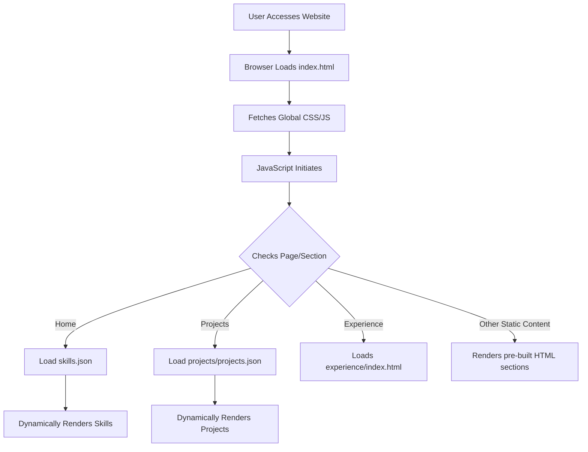

# 🚀 Dynamic Portfolio Website

<p align="center"></p>

## Short Description
Presenting a meticulously crafted, fully responsive, and dynamic personal portfolio website designed to showcase your skills, experience, and projects with unparalleled elegance and professionalism. Built for developers, designers, and creatives, this platform provides a stunning and engaging online presence that adapts seamlessly to any device. With a focus on clean code, modular design, and an excellent user experience, this repository offers a robust foundation for anyone looking to make a powerful statement in the digital realm.

## ✨ Key Features
*   **Stunning Responsive Design:** Optimized for a flawless viewing experience across desktops, tablets, and mobile devices.
*   **Modular & Data-Driven Content:** Easily update skills and projects by modifying simple JSON files (`skills.json`, `projects/projects.json`), eliminating the need to touch core HTML.
*   **Dedicated Sections:** Comprehensive layouts for showcasing your `Experience`, `Projects`, and a `Contact` page, ensuring visitors can find all crucial information.
*   **Interactive UI Elements:** Incorporates engaging visual effects and animations (e.g., `particles.min.js`) to enhance user interaction and aesthetic appeal.
*   **Professional Setup:** Includes a custom 404 error page (`404.html`) for a polished user journey and leverages GitHub Actions for streamlined CI/CD (`.github/workflows/ci-cd.yml`).
*   **Direct Resume Access:** Provides a quick and convenient link to your resume (`assests/resume.pdf`), making it effortless for potential employers to learn more.
*   **Clean & Maintainable Codebase:** Structured with well-organized HTML, CSS, and JavaScript files for easy customization and future expansion.

## Who is this for?
This project is ideal for:
*   **Software Developers & Engineers:** Showcase your coding prowess and projects.
*   **UI/UX Designers:** Display your portfolio of design work and creative solutions.
*   **Freelancers & Consultants:** Establish a strong online presence to attract clients.
*   **Students & Entry-Level Professionals:** Create an impressive first impression for recruiters and hiring managers.
*   **Anyone seeking a modern, impactful online resume and portfolio.**

## Technology Stack & Architecture
This portfolio website is a prime example of a modern, client-side rendered application, leveraging fundamental web technologies for speed, scalability, and ease of deployment.

*   **Frontend:**
    *   **HTML5:** Semantic structure for robust content.
    *   **CSS3:** Beautiful, responsive styling (`assests/css/style.css`, `assests/css/404.css`).
    *   **JavaScript (ES6+):** Dynamic content loading, interactive elements, and overall client-side functionality (`assests/js/app.js`, `assests/js/script.js`, `assests/js/particles.min.js`).
*   **Data Layer:**
    *   **JSON:** Light-weight, easily parsable data files (`skills.json`, `projects/projects.json`) serve as the content backend for dynamic sections.
*   **Deployment & Workflow:**
    *   **GitHub Actions:** Automated Continuous Integration/Continuous Deployment (CI/CD) pipeline for efficient updates and deployments (`.github/workflows/ci-cd.yml`).

## 📊 Architecture & Database Schema
Given this is a static, client-side portfolio, there is no traditional server-side database. The architecture focuses on dynamic content injection into the frontend.



## ⚡ Quick Start Guide
Get your personalized portfolio up and running in no time!

1.  **Clone the Repository:**
    ```bash
    git clone https://github.com/brundhanchittoju-hash/portfolio_website.git
    cd portfolio_website
    ```

2.  **Local Development:**
    Simply open `index.html` in your web browser. Due to the client-side nature, no special server setup is required for basic viewing. For certain features (like dynamic content fetching from local JSON files in some browsers), a local server might be beneficial (e.g., using VS Code's Live Server extension or Python's `http.server`).

3.  **Customize Your Content:**
    *   Update your personal information directly in `index.html`.
    *   Modify your skills in `skills.json`.
    *   Add or update your projects in `projects/projects.json`.
    *   Replace `assests/resume.pdf` with your own resume.
    *   Personalize images in `assests/images/` and update paths in HTML/CSS as needed.

4.  **Deployment:**
    This project is perfectly suited for static site hosting services like GitHub Pages, Netlify, Vercel, or AWS S3. Push your changes to your chosen platform, and the `.github/workflows/ci-cd.yml` workflow can automate the deployment process if configured for your branch.

## 📜 License
This project is licensed under the terms found in the `LICENSE` file.